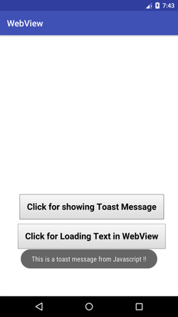
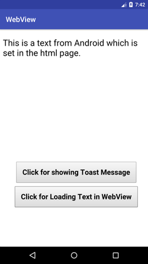

# WebViewDemo

A demo project for showing how to use WebViews in Android.

## Things covered in this project

* Load a local html file into a WebView with the basic WebView settings.
* Handle Javascript callbacks from the Javascript to the client.
* Make Javascript callbacks from the client to Javascript.
* Set WebViewClient to the WebView
* Debugging of WebView

  

 &nbsp; &nbsp; &nbsp; &nbsp;&nbsp;  &nbsp; &nbsp; &nbsp; &nbsp;&nbsp;  

I wrote a blog about how this. [Here](https://blog.mindorks.com/webview-love-it-or-hate-it-but-you-cant-ignore-it-d471bc95d81e) is the post.

=====

Checkout my other projects

[AppDataReader](https://github.com/Ansh1234/AppDataReader) - A library for reading Shared Preferences and Database values within the application.
[RxDownloader](https://github.com/Ansh1234/RxDownloader)- Demo of Downloading Songs/Images through Android Download Manager using RxJava2
[RxFbLiveVideoEmoticons](https://github.com/Ansh1234/RxFbLiveVideoEmoticons) - Demo of Fb Live Video Reactions using RxJava2
